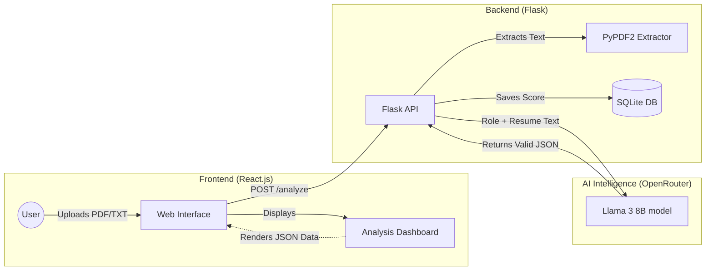

# System Architecture and Logic: Resume AI Shortlister

This document provides a detailed explanation of the Resume AI Shortlister's inner workings, shortlisting logic, model details, and proposed cloud infrastructure.

## 1. How It Works (System Flow)

The application follows a modern client-server architecture to process and analyze resumes.

### Workflow Sequence:
1.  **Resume Upload**: The user selects a resume (PDF or TXT) and a target job role on the React-based frontend.
2.  **API Request**: The frontend sends a multipart POST request to the Flask backend (`/api/analyze-resume`).
3.  **Text Extraction**: The backend uses `PyPDF2` (via `utils.py`) to extract raw text content from the uploaded file.
4.  **AI Evaluation**: The extracted text and the job role are sent to the AI model (`meta-llama/llama-3-8b-instruct`) through the OpenRouter API.
5.  **Structured JSON Response**: The AI analyzes the resume against the role and returns a structured JSON object containing a score, shortlist status, strengths, weaknesses, and suggestions.
6.  **Results Display**: The frontend parses this JSON and renders a premium dashboard showing the candidate's metrics and feedback.

## 2. Shortlisting Logic & Thresholds

The shortlisting process is driven by an AI-powered evaluation system that ensures objective and standardized scoring.

### Scoring Criteria:
The AI is instructed to evaluate the candidate based on:
- **Skill Alignment**: How well the technical and soft skills match the job role.
- **Experience Relevance**: The depth and relevance of previous work history.
- **Educational Background**: Alignment with the required academic qualifications.

### The Threshold Point:
The system uses a hard-coded threshold for the final shortlist decision:
- **Threshold Score: 60 / 100**
- **Logic**: If the AI-generated score is **60 or higher**, the candidate is marked as **"Shortlisted"**. If it is below 60, they are "Not Shortlisted".

> [!NOTE]
> The score is normalized. If the model returns a 1-10 scale, the system automatically converts it to a 10-100 scale for consistency.

## 3. AI Model Description

The core intelligence of the application is powered by a Large Language Model (LLM).

- **Model Name**: `meta-llama/llama-3-8b-instruct`
- **Provider**: Hosted via **OpenRouter**, allowing for flexible and high-performance inference.
- **Functionality**: The model acts as a "Reasoning Engine." It doesn't just look for keywords; it understands context, project impact, and the nuances of professional summaries.
- **Parameters**: The model is tuned with a low `temperature` (0.1) to ensure responses are deterministic, factual, and strictly follow the required JSON schema.

## 4. Working Diagram

## 5. Persistence and Storage

The system ensures that no analysis is lost. Every time a resume is processed, it is automatically stored in a local **SQLite** database (`resumes.db`).

- **Stored Data**: Original filename, extracted text, targeted role, AI score, and the full structured JSON analysis.
- **Visualization**: Historical results can be retrieved via the `/api/resumes` endpoint.

## 6. Cloud Structure (Proposed Deployment)

For a production-ready environment, the following cloud-native structure is recommended:

| Component | Service Recommendation | Purpose |
| :--- | :--- | :--- |
| **Frontend** | Vercel / Netlify | Fast global CDN delivery of the React app. |
| **Backend API** | AWS App Runner / Render | Scalable containerized Flask service. |
| **AI Processing** | OpenRouter (Current) | External API for LLM inference. |
| **Object Storage** | AWS S3 | To store actual PDF files (instead of just local memory). |
| **Database** | Supabase (PostgreSQL) | Scalable database for candidate history and scores. |
| **Secrets** | AWS Secrets Manager | Securely managing the OpenRouter API Key. |
